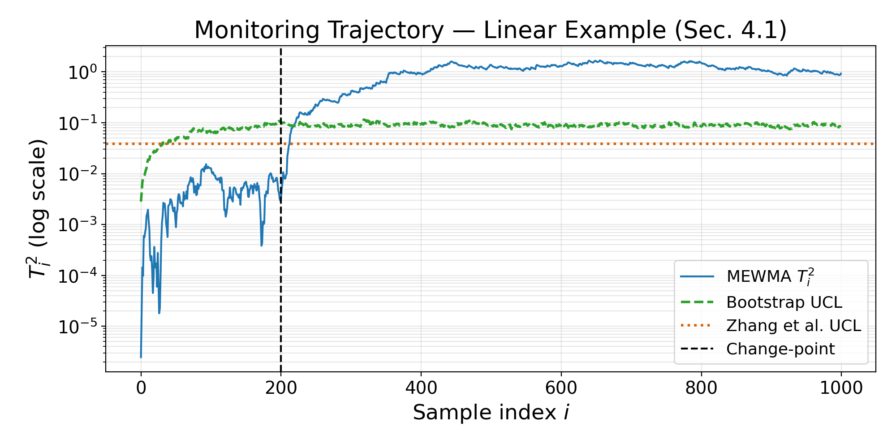
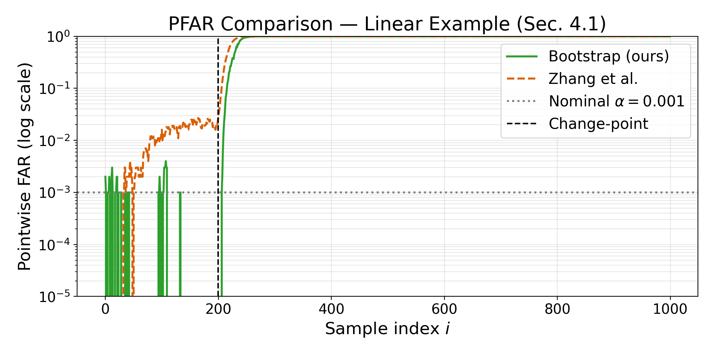
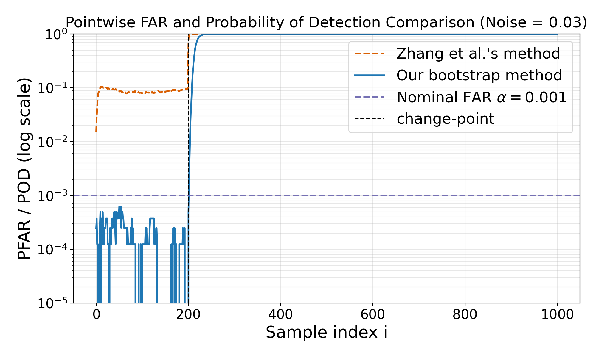
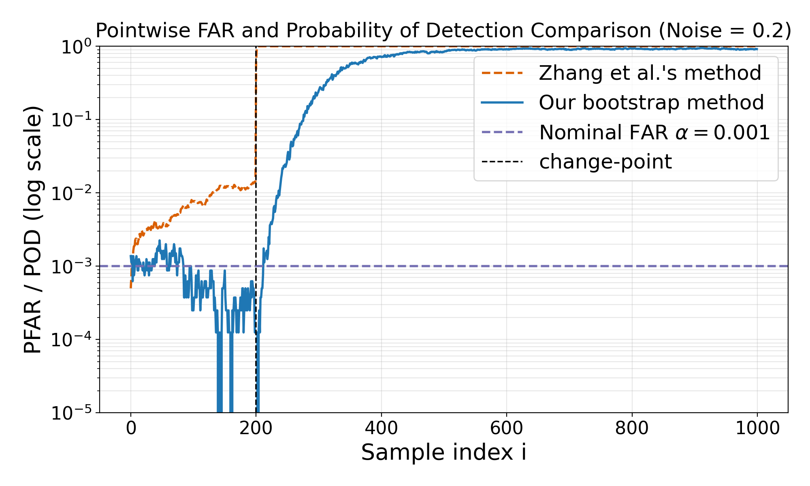

# Bootstrapped Control Limits for Score-Based Concept Drift Control Charts

Code repository for the paper:

> **"Bootstrapped Control Limits for Score-Based Concept Drift Control Charts"**
> [](https://arxiv.org/abs/2507.16749)


Implements the nested bootstrap control-limit calibration method for score-based
MEWMA drift detection charts, with comparisons against the two-phase baseline of
Zhang et al. (2023).

---

## Repository Structure

```
linear/                      # Section 4.1 — linear mixture example
├── linear_demo.py           # Complete pipeline (run this to reproduce Section 4.1)
├── kungang_far.py           # Zhang et al. two-phase baseline
├── sbatch_linear.sh         # SLURM: serial run of linear_demo.py
├── sbatch_kungang_far.sh    # SLURM: Zhang et al. baseline
└── outputs/                 # Pre-computed results
    ├── trajectory.png           Figure 4.2(a) — single monitoring trajectory
    ├── pfar_comparison.png      Figure 4.2(b) — PFAR comparison
    ├── pfar_boot.csv            Bootstrap PFAR values
    └── pfar_kungang.csv         Zhang et al. PFAR values

oscillator/                  # Section 4.2 — nonlinear oscillator example
├── pfar_quick_demo.py       # Serial bootstrap UCL + PFAR (run this)
├── run_bootstrap_chunk.py   # Parallel SLURM array worker
├── kungang_far_nonlinear.py # Zhang et al. two-phase baseline
├── pfar_chunk.py            # PFAR estimation worker (parallel)
├── pfar_power_chunk.py      # Power estimation worker (parallel)
├── aggregate_ucl.py         # Aggregate parallel chunks -> UCL
├── aggregate_pfar.py        # Aggregate parallel PFAR chunks
├── aggregate_pfar_power.py  # Aggregate parallel power chunks
├── sbatch_pfar_quick.sh         SLURM: serial run
├── sbatch_bootstrap_array.sh    SLURM: parallel bootstrap (job array)
├── sbatch_pfar_array.sh         SLURM: parallel PFAR estimation
├── sbatch_kungang_nonlinear.sh  SLURM: Zhang et al. baseline
└── outputs/                 # Pre-computed results
    ├── pfar_boot_noise0.03.png      Bootstrap PFAR, σ = 0.03
    ├── pfar_boot_noise0.20.png      Bootstrap PFAR, σ = 0.20
    ├── pfar_kungang_noise0.03.png   Zhang et al. PFAR, σ = 0.03
    ├── pfar_kungang_noise0.20.png   Zhang et al. PFAR, σ = 0.20
    ├── compare_pfar_noise0.03.png   Side-by-side PFAR comparison, σ = 0.03
    ├── compare_pfar_noise0.20.png   Side-by-side PFAR comparison, σ = 0.20
    ├── compare_power_noise0.03.png  Detection power comparison, σ = 0.03
    └── compare_power_noise0.20.png  Detection power comparison, σ = 0.20

timing/                      # Appendix C.2 — compute time comparison
├── make_comparison_table.py # Build Table C.1 (LaTeX / Markdown / CSV)
├── compare_times.py         # Print raw timing numbers
├── collect_system_info.py   # Record hardware/software details
├── plot_compare_far.py      # Overlay PFAR curves
├── plot_parallel_speedup.py # Parallel speedup plot
├── plot_pfar_power.py       # Power comparison plot
└── outputs/                 # Pre-computed Table C.1
    ├── compare_times.tex
    ├── compare_times.md
    └── compare_times.csv
```

---

## Requirements

```bash
pip install -r requirements.txt
```

Core: `numpy`, `scipy`, `matplotlib`.
Section 4.2 additionally requires `torch` (CPU is sufficient for small runs).

---

## Section 4.1 — Linear Mixture (Quick Start)

The primary reproducibility target. Runs entirely on CPU in a few minutes.

```bash
cd linear
python linear_demo.py
```

This generates `outputs/trajectory.png` and `outputs/pfar_comparison.png` —
the key figures for Section 4.1.

**Quick smoke test (seconds):**

```bash
python linear_demo.py --B-outer 5 --B-inner 10 --R 20
```

**Key CLI options:**

| Flag | Default | Description |
|---|---|---|
| `--n-tr` | 2000 | Baseline training size |
| `--B-outer` | 100 | Outer bootstrap replicates |
| `--B-inner` | 200 | Inner bootstrap replicates |
| `--R` | 2000 | Monte Carlo replicates for PFAR |
| `--gamma` | 0.1 | Ridge penalty γ |
| `--lam` | 0.01 | MEWMA smoothing λ |
| `--n-ic / --n-oc` | 200 / 800 | IC / OC observations per stream |

On a cluster (submit from the `linear/` directory):

```bash
cd linear
sbatch sbatch_linear.sh
```

---

## Section 4.2 — Nonlinear Oscillator

### Serial run (single node)

```bash
cd oscillator
python pfar_quick_demo.py --noise 0.03 0.20 --outdir outputs/serial
```

Or via SLURM (submit from `oscillator/`):

```bash
cd oscillator
sbatch sbatch_pfar_quick.sh
```

### Parallel run (SLURM job array, recommended)

```bash
cd oscillator
sbatch sbatch_bootstrap_array.sh   # outer bootstrap, 10 tasks × ~5 reps each
```

After all tasks finish, aggregate:

```bash
for noise in 0.03 0.20; do
  python aggregate_ucl.py --outdir outputs/noise${noise}
done
```

Then estimate PFAR on the aggregated UCL:

```bash
sbatch sbatch_pfar_array.sh
```

### Zhang et al. (2023) baseline — Section 4.2

```bash
cd oscillator
python kungang_far_nonlinear.py --noise 0.03 0.20 --outdir outputs/kungang
```

---

## Appendix C.2 — Compute Time Comparison

After running the serial, parallel, and Kungang jobs for Section 4.2,
build Table C.1 from the `timing/` directory:

```bash
cd timing
python make_comparison_table.py \
  --noise 0.03 0.20 \
  --ours-serial-dir    ../oscillator/outputs/serial \
  --ours-parallel-root ../oscillator/outputs \
  --ours-parallel-prefix noise \
  --kg-dir             ../oscillator/outputs/kungang \
  --out-csv outputs/compare_times.csv \
  --out-md  outputs/compare_times.md \
  --out-tex outputs/compare_times.tex
```

Pre-computed results are in `timing/outputs/`.

---

## Algorithm Overview

**Nested bootstrap UCL (Algorithm 1):**

1. Fit baseline model θ̂ on n training observations; compute score vectors
   `s_i = ∇_θ L(θ̂; xᵢ, yᵢ)` and their mean s̄ and covariance Σ̂.

2. **Outer loop** (b = 1, …, B_O): bootstrap resample, refit model θ̂ᵇ,
   compute OOB scores.

3. **Inner loop** (j = 1, …, B_I): resample M OOB scores, compute the MEWMA
   T² statistic with the **k-correction** (Theorem 3.1, Eq. 3.3) to compensate
   for the OOB set size (≈ 36.8% of n).

4. UCL: percentile of the B_O × B_I T² trajectories at each time index i.

**Score vectors (linear case, Eq. 4.3):**

```
s(θ; xᵢ, yᵢ) = (yᵢ − xᵢᵀθ) xᵢ − (γ/n) θ̃
```

where θ̃ zeroes the intercept. Zero-mean property holds at the ridge minimiser
(KKT stationarity).

**k-correction (Eq. 3.3):**

```
k(λ, i, n) = [λ/(2−λ)(1−(1−λ)^{2i}) + 3.72/n · (1−(1−λ)^i)²]
           / [λ/(2−λ)(1−(1−λ)^{2i}) +  1/n  · (1−(1−λ)^i)²]
```

Applied as z̃ᵢ = zᵢ / √k before computing T²ᵢ = (z̃ᵢ − s̄)ᵀ Σ̂⁻¹ (z̃ᵢ − s̄).

---

## Results

### Section 4.1 — Linear Mixture

|  |  |
|:---:|:---:|
| Single monitoring trajectory | PFAR comparison (bootstrap vs. Zhang et al.) |

| Metric | Value |
|---|---|
| Zero-mean score ‖s̄‖ | 1.3 × 10⁻¹⁴ (machine precision) |
| IC PFAR — Bootstrap | **0.0003** ≤ α = 0.001 ✓ |
| IC PFAR — Zhang et al. | 0.0115 — 11× above target |

### Section 4.2 — Nonlinear Oscillator

|  |  |
|:---:|:---:|
| PFAR and POD, σ = 0.03 | PFAR and POD, σ = 0.20 |

### Appendix C.2 — Compute Time (Table C.1)

| noise | ours serial (min) | ours parallel est (min) | ours parallel best (min) | Zhang et al. fit (min) |
|---|---:|---:|---:|---:|
| 0.03 | 3.2 | 0.7 | 0.1 | 0.5 |
| 0.20 | 3.2 | 0.7 | 0.1 | 0.7 |

---

## Citation

If you use this code, please cite the accompanying paper (under review).
